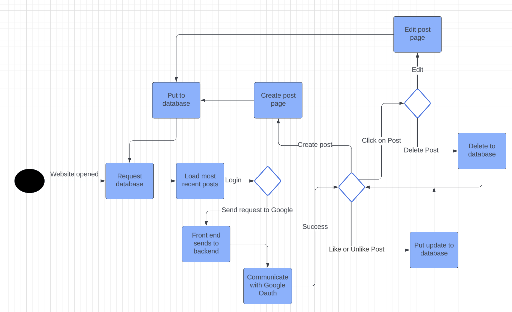
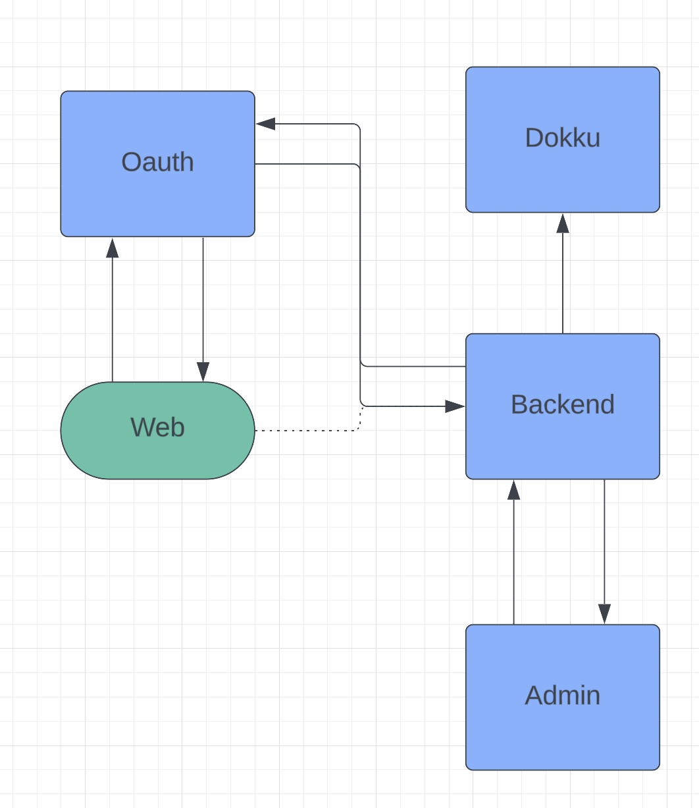
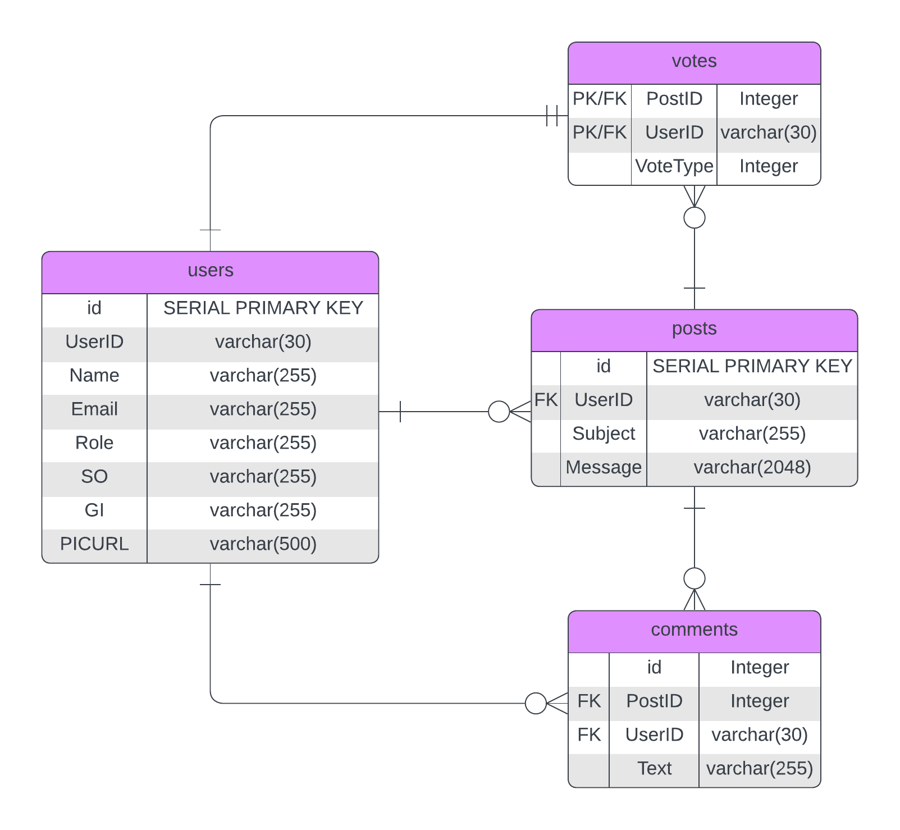
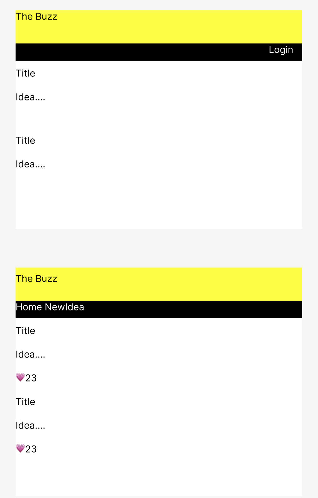

# Phase 1
## Sprint 08

### Additional Routes
	* Route to get oauth token
	* Possibly restructure the backend so that there are sepearate routes for each action

### User Stories
	* As a website visitor I want to view posts so that I can learn about my company
		* Test: Ensure that a user can see posts in the database
	* As an authethicated website user I want to like posts so that I can learn share my interest
		* Test: Ensure that a user can like a post
	* As an authethicated website user I want to unlike posts so that I can change my interest in a post
		* Test: Ensure that a user can unlike a post
	* As an authethicated website user I want to create a post so that I can share what I am thinking about
		* Test: Ensure that a user can create a post
	* As an authethicated website user I want to delete a post so that I can unshare what I am thinking about
		* Test: Ensure that a user can delete a post
	* As a website visitor, I want to login so that I can have full access to the website
		* Test: Ensure that a user can login
### Admin Stories
	* As an admin I want to disable users so that I can prevent unauthorized users
		* Test: Ensure that an admin can delete unwanted users
	* As an admin I want to delete posts so that I can delete bad content 
		* Test: Ensure that an admin can delete unwanted posts
### Tests
	* Backend 
		* Test that all routes are functional in all cases (post, put, delete, etc)
		* Ensure that the correct data is being sent
		* Ensure that OAuth works
	* Admin
		*  Posts can be deleted
		* Users can be deleted
	* Web
		* Post can be created
		* Post can be liked and unliked
		* The post can be viewed
		* Can scroll on the webpage
	* Mobile 
		* N/A - team of 4

<!--
### 
### 
### 
### 
-->

---