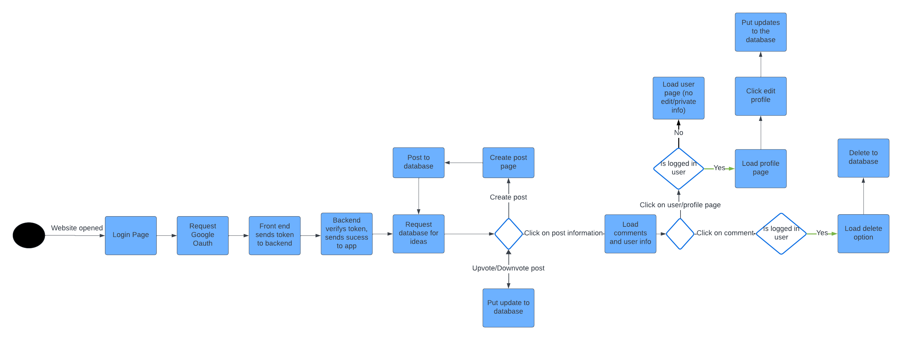
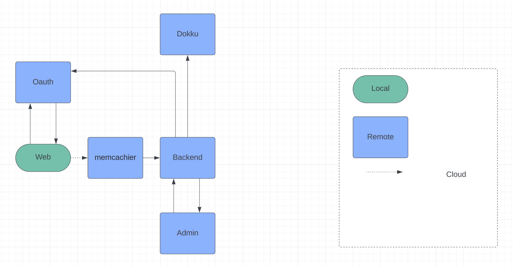

# Phase 3

### Summary / Overview
- Website for employees to post short ideas (messages), and other employees can like (and remove a like from) that idea.

### Project Information 
- CSE 216 Section 10
- Team 03
- Name: Team ducks
### Project Members/Contributors (name, email address, role in phase)
* Project Manger:<Anya Kumar, ank726@lehigh.edu>   
* Web: <Julian Chattopadhyay, juc226@lehigh.edu>   
* Admin: <Matthew Martinez, mamf26@lehigh.edu> 
* Backend: <Jeffrey Lin, jel326@lehigh.edu>
### What this tagged release does
- this is our final submission and is a fully function app according to the requirements for the project
### How to run:
* cd web
* npm start

### Additional Routes
	* Route to upload files
	* Route to get files from google drive

### User Stories
	* As a website visitor I want to view posts so that I can learn about my company
		* Test: Ensure that a user can see posts in the database
	* As an authethicated website user I want to like posts so that I can learn share my interest
		* Test: Ensure that a user can like a post
	* As an authethicated website user I want to unlike posts so that I can change my interest in a post
		* Test: Ensure that a user can unlike a post
	* As an authethicated website user I want to create a post so that I can share what I am thinking about
		* Test: Ensure that a user can create a post
	* As an authethicated website user I want to delete a post so that I can unshare what I am thinking about
		* Test: Ensure that a user can delete a post
	* As a website visitor, I want to login so that I can have full access to the website
		* Test: Ensure that a user can login
    * As an authethicated website user I want to create post where I can add links and links to files
        * Test: ensure that user can add links and links to files
### Admin Stories
	* As an admin I want to disable users so that I can prevent unauthorized users
		* Test: Ensure that an admin can delete unwanted users
	* As an admin I want to delete posts so that I can delete bad content 
		* Test: Ensure that an admin can delete unwanted posts
	* As an admin I want to delete posts that are outdated
		* Test: Ensure that an admin can validate/invalidate any user submissions
	* As an admin I want to manage the storage to maintain a quota
		* Ensure that an admin can delete uploaded posts (posts that aren't recently used)
### Tests
	* Backend 
		* Test that all routes are functional in all cases (post, put, delete, etc)
		* Ensure that the correct data is being sent
		* Ensure that OAuth works
	* Admin
		*  Posts can be deleted
		* Users can be deleted
	* Web
		* Post can be created
		* Post can be liked and unliked
		* The post can be viewed
		* Can scroll on the webpage
	* Mobile 
		* N/A - team of 4

