# Scheme-Like Language (slang): Scanning

The following diagrams express the regular language that governs the scanner for
slang.  They result in a non-deterministic finite automata (NDFA).

## Punctuation and Comments

This diagram expresses the main concepts of the NDFA format that we'll use to
define slang.

- Circles (not filled): These represent transitional states that do not produce
  a token.
- Circles (filled): These states, when reached, produce a token
- Labels: These indicate which character of input must be present in order to
  make a transition.
- ε transitions: These transitions happen without consuming a character of
  input.
- Errors: If there is no way out of a state, then the scan should halt, and an
  error message should be produced.
- Token text: When a filled circle is reached, the relevant token text will be
  all characters that were observed since the last time the scanner was in the
  start state.  Note that this rule allows for INCOMMENT to consume characters
  of input without creating a token.

With the above rules laid out, we can define the sub-NDFA for punctuation and
comments as follows:

```mermaid
graph TD
    %%% These aren't tokens, but they are real states
    %% Each time around the while loop, we start here
    START((START)) 
    %% This is the end of scanning
    EOF((EOFTOKEN))

    %%% These are the states that correspond to Scanner tokens.
    %% Special symbols
    LPAREN((LPAREN))
    RPAREN((RPAREN))
    ABBREV((ABBREV))
    DOT((DOT))
    
    %%% These are the transient and non-accepting states
    %% In a comment
    INCOMMENT((INCOMMENT))
    %% This is our special transition for getting out of one token and into the 
    %% next.
    CLEANBREAK((CLEANBREAK))

    %%% Rules

    %% "Whitespace Doesn't Matter"
    START      --ε-->                         CLEANBREAK
    CLEANBREAK --"{' ', '\t', '\n', '\r'}"--> START
    %% The file has to end eventually
    CLEANBREAK --"\0"--> EOF
    
    %% Special Characters
    %% Abbrev never starts something else, never terminates something else
    START       --"'"-->  ABBREV
    ABBREV      --ε-->    START
    %% Dot can't start an identifier or terminate something else
    START       --"."-->  DOT
    DOT         --ε-->    CLEANBREAK
    %% LPAREN/RPAREN never start something else, but can terminate
    CLEANBREAK  --"("-->  LPAREN
    LPAREN      --ε-->    START
    CLEANBREAK  --")"-->  RPAREN
    RPAREN      --ε-->    START
    
    %% Comments
    CLEANBREAK --";"--> INCOMMENT
    INCOMMENT --"any character except \n or \0"--> INCOMMENT
    INCOMMENT --"\n"--> START
    %% File can end with a comment
    INCOMMENT  --"\0"--> EOF

    %% Mermaid Formatting: Make sure all the tokens have a special color, to 
    %% distinguish them
    style LPAREN fill:#999999
    style RPAREN fill:#999999
    style ABBREV fill:#999999
    style DOT fill:#999999
    style EOF fill:#999999
```

## Keywords

The following sub-NDFA describes how keywords are detected.  Note that this is
something of a shorthand, because it specifies the *whole keyword*, rather than
a set of intermediate states as each character is encountered.  The scanner must
be able to distinguish between these keywords and an identifier.

## Vector, Char, and Bool

The punctuation for the start of a vector shares a common starting token with
the start of a bool or character.  Furthermore, there are a few special
character tokens that require more than three characters to express.  This NDFA
captures those possibilities.  Note that the keyword sub-NDFA is highly relevant
to this sub-NDFA, because this, too, has shorthand for some multi-character
sequences that produce a single token.

## Identifiers and Numbers

Slang treats `+` and `-` as identifiers, not special tokens.  These characters
can also begin a number.  This leads to a slight entanglement of the NDFAs for
identifiers and numbers.

Numbers introduce a few more considerations.  First, we do not allow a number to
begin with `.`.  There must always be a numerical value on the left hand side,
even though it might be `0`.  Second, we do not validate that numerical
constants fit within the bit sizes supported by the language.  A 70-bit integer
constant will not cause the scanner to fail.  Third, the constants `NaN` and
`+/- inf` are not part of the grammar.  These are run-time constants.

## Strings

Strings are relatively straightforward, except that there are a few escape
sequences.

## Full Diagram

The full grammar is achieved by joining all of the preceding NDFAs.

